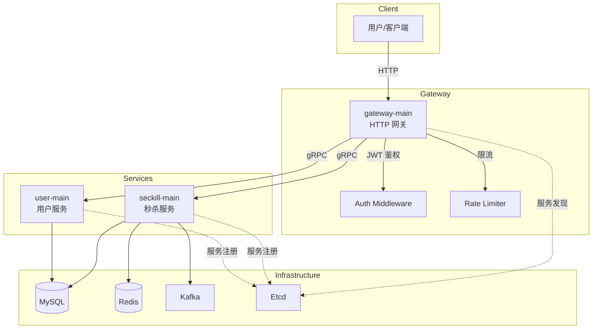
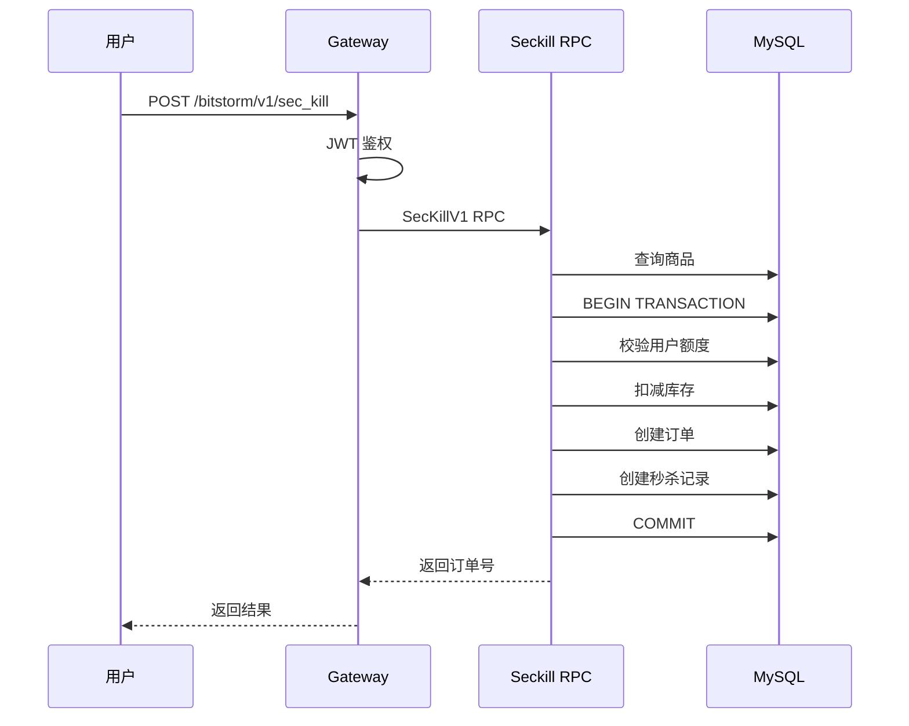
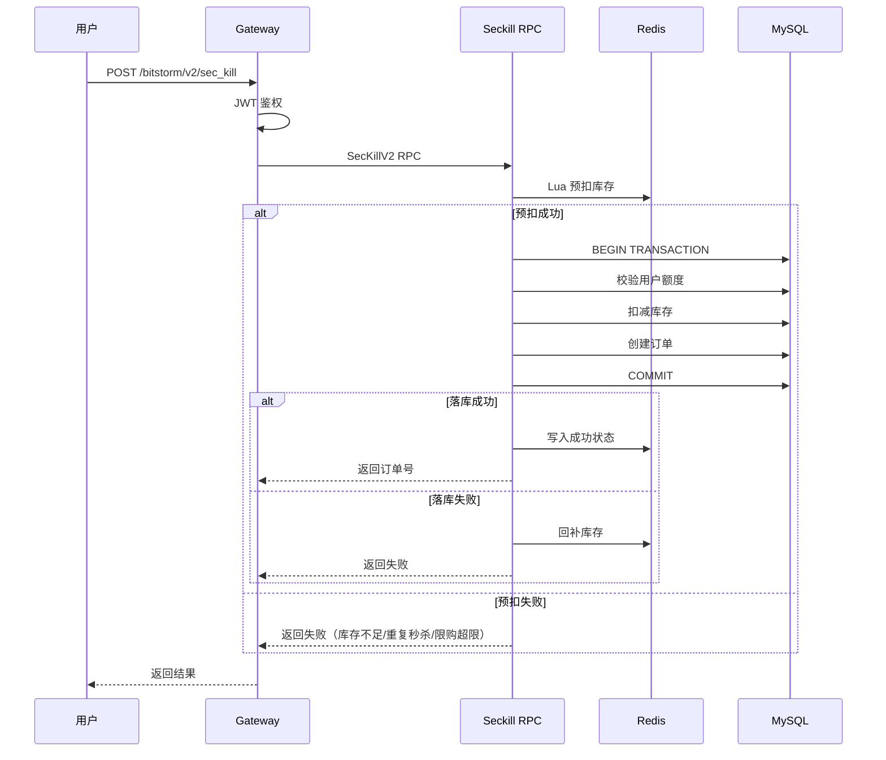
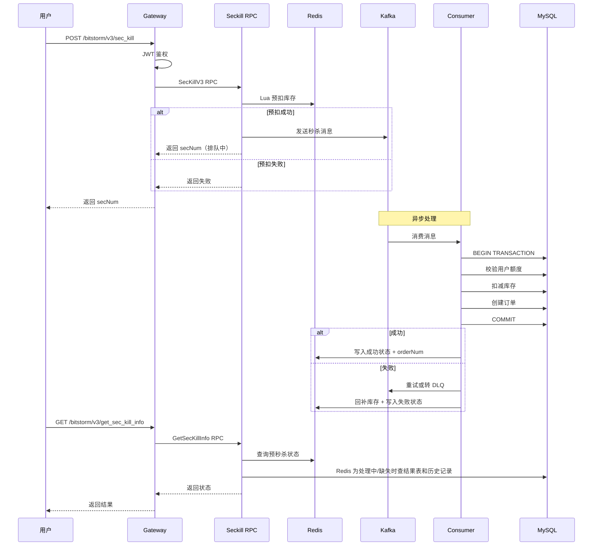

# SecKill 学习项目

这是一个以秒杀主流程为中心的微服务学习项目，不是生产级系统。

项目的核心目标不是做一个大而全的电商平台，而是用尽量短的链路，把一次秒杀请求里最关键的几个问题讲清楚：

- 请求怎么进入系统
- 库存和资格怎么校验
- 为什么 `V1 / V2 / V3` 要逐步演进
- 为什么高并发场景里会引入 Redis 和 MQ
- 为什么异步秒杀需要结果查询接口

如果把这个项目看成一句话，就是：

`一个用 go-zero + gRPC + MySQL + Redis + Kafka 搭出来的秒杀演进学习样例`

## 这个项目是干什么的

这个项目用三版秒杀实现来演示典型的高并发秒杀优化路径：

- `V1`
  - 最基础的数据库事务秒杀
- `V2`
  - 在 `V1` 上加入 Redis 预扣库存、防重复秒杀、前置限购校验
- `V3`
  - 在 `V2` 上加入 Kafka 异步下单和 `GetSecKillInfo` 查询闭环

所以它不是为了展示“功能很多”，而是为了展示“为什么要这样演进”。

适合的使用方式：

- 想快速理解秒杀系统的主流程
- 想看数据库事务、Redis 预扣、MQ 异步三种方案怎么落到代码里
- 想把一个微服务项目从 HTTP 入口一路追到库存、订单和结果查询

## 系统架构图



## V1 / V2 / V3 时序图

### V1：数据库事务秒杀



### V2：Redis 预扣 + 同步落库



### V3：Redis 预扣 + MQ 异步



## 技术栈

### 核心框架

- `go-zero`
  - 网关 HTTP 服务、RPC 服务、配置加载
- `gRPC + protobuf`
  - `gateway-main` 到 `user-main / seckill-main` 的服务间调用
- `GORM`
  - MySQL 数据访问

### 中间件与基础组件

- `MySQL`
  - 商品、库存、订单、秒杀记录、额度数据
- `Redis`
  - 热点商品缓存、库存预扣、重复秒杀和限购前置校验、限流依赖
- `Kafka`
  - `V3` 的异步削峰、重试队列和死信队列
- `Etcd`
  - RPC 服务注册与发现
- `JWT`
  - 登录后网关鉴权
- `Docker Compose`
  - 本地依赖启动

### 代码层面还用到了

- `segmentio/kafka-go`
- `redis/go-redis`
- `golang-jwt/jwt`
- `automaxprocs`

## 仓库目录结构

```text
SecKill
├── docker/                      # Docker 初始化资源
│   └── mysql/initdb/            # MySQL 建库建表和初始化数据
├── gateway-main/                # HTTP 入口层
│   ├── cmd/                     # 启动入口
│   ├── etc/                     # 网关配置
│   ├── internal/                # handler/logic/middleware/svc 等实现
│   └── limiter/                 # 路由限流实现
├── scripts/
│   ├── integration/             # 端到端集成测试
│   └── perf/                    # 压测和对比脚本
├── seckill-main/                # 秒杀核心服务
│   ├── api/                     # protobuf 定义
│   ├── cmd/                     # RPC 服务和 MQ consumer 启动入口
│   ├── etc/                     # 秒杀服务配置
│   ├── internal/
│   │   ├── logic/seckill/       # V1/V2/V3 和结果查询主流程
│   │   ├── data/                # MySQL/Redis/Kafka 访问
│   │   ├── server/              # gRPC 接入层
│   │   └── svc/                 # 依赖注入
│   └── sql/                     # 秒杀相关表结构参考
├── user-main/                   # 用户与登录支撑服务
│   ├── api/                     # protobuf 定义
│   ├── cmd/                     # RPC 启动入口
│   ├── etc/                     # 用户服务配置
│   ├── internal/                # user logic/data/server/svc
│   └── sql/                     # 用户表结构参考
├── docker-compose.yml           # 本地依赖编排
├── start_and_test.sh            # 一键启动和功能演示脚本
└── 学习.md                       # 主流程、代码阅读顺序、V1/V2/V3 说明
```

## 各目录作用

- `gateway-main`
  - 项目的 HTTP 门面，负责登录、鉴权、限流、转 RPC
- `seckill-main`
  - 项目主角，核心秒杀逻辑都在这里
- `user-main`
  - 为登录和用户查询提供最小支撑能力
- `docker`
  - 依赖服务初始化脚本，尤其是 MySQL 初始表结构和测试数据
- `scripts/perf`
  - 压测和结果对比脚本（含自动断言）
- `scripts/integration`
  - 端到端集成测试脚本
- `start_and_test.sh`
  - 最快的演示入口，会拉起依赖、启动服务、重置测试数据并跑接口

## 学习主线

推荐把项目理解成一条主链路：

`login -> gateway -> seckill rpc -> 库存/资格校验 -> 下单或排队 -> 查询秒杀结果`

其中最关键的是 `seckill-main/internal/logic/seckill`。

三版秒杀的定位：

- `V1`
  - 纯数据库事务秒杀，作为基线版本
- `V2`
  - Redis 预扣库存 + 防重复秒杀 + 同步落库
- `V3`
  - Redis 预扣库存 + MQ 异步下单 + `GetSecKillInfo` 查询闭环

## 快速启动

### 依赖

- Docker / Docker Compose
- Go
- curl
- nc
- lsof

### 一键演示

在仓库根目录运行：

```bash
bash ./start_and_test.sh
```

这个脚本会做这些事：

- 启动 `etcd / mysql / redis / kafka`
- 启动 `user-main / seckill-main / gateway-main`
- 重置 MySQL 秒杀测试数据
- 设置 Redis 热点库存和限购 key
- 依次调用登录、`V1`、`V2`、`V3`、`GetSecKillInfo`

如果只是启动服务：

```bash
bash ./start_and_test.sh start
```

如果只跑接口测试：

```bash
bash ./start_and_test.sh test
```

停止服务：

```bash
bash ./start_and_test.sh stop
```

## 演示账号和测试数据

- 用户名：`admin`
- 密码：`123321`
- 商品编号：`abc123`
- 商品 ID：`1`

默认演示环境：

- Gateway：`127.0.0.1:8998`
- Gateway Health：`127.0.0.1:8998/health`、`127.0.0.1:8998/ready`
- User RPC：`127.0.0.1:8669`
- User Health：`127.0.0.1:8670`
- Seckill RPC：`127.0.0.1:8002`
- Seckill Health：`127.0.0.1:8003`
- MySQL：`127.0.0.1:3307`
- Redis：`127.0.0.1:6379`
- Kafka：`127.0.0.1:9092`
- Etcd：`127.0.0.1:20001`

## 常用请求

登录：

```bash
curl -X POST http://127.0.0.1:8998/login \
  -H 'Content-Type: application/json' \
  -d '{"username":"admin","password":"123321"}'
```

发起 `V1` 秒杀：

```bash
curl -X POST http://127.0.0.1:8998/bitstorm/v1/sec_kill \
  -H "Authorization: Bearer <token>" \
  -H 'Content-Type: application/json' \
  -d '{"goodsNum":"abc123","num":1}'
```

发起 `V2` 秒杀：

```bash
curl -X POST http://127.0.0.1:8998/bitstorm/v2/sec_kill \
  -H "Authorization: Bearer <token>" \
  -H 'Content-Type: application/json' \
  -d '{"goodsNum":"abc123","num":1}'
```

发起 `V3` 秒杀：

```bash
curl -X POST http://127.0.0.1:8998/bitstorm/v3/sec_kill \
  -H "Authorization: Bearer <token>" \
  -H 'Content-Type: application/json' \
  -d '{"goodsNum":"abc123","num":1}'
```

查询 `V3` 秒杀结果：

```bash
curl "http://127.0.0.1:8998/bitstorm/v3/get_sec_kill_info?sec_num=<secNum>" \
  -H "Authorization: Bearer <token>"
```

## 错误处理约定

当前版本把错误边界固定成两层：

- 业务失败
  - 继续返回原有业务响应结构
  - 通过 `code/message` 表达，比如库存不足、重复秒杀、额度不足
- 基础设施失败
  - 通过 gRPC error 在服务间传播
  - 由 gateway 统一映射成结构化 HTTP 错误

gateway 的默认映射：

- `400`
  - 请求参数不合法
- `401`
  - 未认证或鉴权失败
- `404`
  - 显式 not found
- `429`
  - 限流
- `503`
  - 下游 RPC、MySQL、Redis、Kafka 不可用或超时
- `500`
  - 未分类内部错误

所以客户端现在不会直接看到底层数据库或网络错误文本。

`V3` 的 Kafka 失败处理现在是完整闭环：

- 业务失败
  - 直接写失败结果，不重试
- 临时基础设施失败
  - 进入 `retry` topic，超过最大次数后转 `DLQ`
- 毒消息
  - 直接进 `DLQ`
- `GetSecKillInfo`
  - 先看 Redis
  - Redis 已经是最终态时直接返回
  - Redis 还是 `BEFORE_ORDER` 或数据缺失时，再查 `t_seckill_async_result` 和 `t_seckill_record`

## 健康检查

为了让启动脚本和本地排查更稳定，现在三个服务都有健康探针：

- `gateway-main`
  - `GET /health`
  - `GET /ready`
- `user-main`
  - `GET http://127.0.0.1:8670/health`
  - `GET http://127.0.0.1:8670/ready`
- `seckill-main`
  - `GET http://127.0.0.1:8003/health`
  - `GET http://127.0.0.1:8003/ready`

语义：

- `/health`
  - 只表示进程存活
- `/ready`
  - 表示关键依赖已可用

`start_and_test.sh` 现在会优先等待 `user-main` 和 `seckill-main` 的 `/ready`，以及 gateway 的 `/health`。

其中 `seckill-main` 的 `/ready` 现在会检查：

- MySQL
- Redis
- Kafka 主 producer
- retry producer
- DLQ producer
- 主 consumer runner
- retry consumer runner

## V1 / V2 / V3 怎么看

- `V1`
  - 先看最基础的数据库事务闭环
- `V2`
  - 再看为什么要把重复秒杀、限购和库存预扣前置到 Redis
- `V3`
  - 最后看为什么要异步化，以及为什么需要 `GetSecKillInfo`

更详细的对比和代码阅读顺序见：

- [学习.md](/home/monody/project/SecKill/学习.md)

## 建议阅读顺序

1. 先读 [学习.md](/home/monody/project/SecKill/学习.md)
2. 再跑一次 `bash ./start_and_test.sh`
3. 然后按下面顺序看代码：
   - `gateway-main/internal/handler/routes.go`
   - `gateway-main/internal/logic/loginlogic.go`
   - `gateway-main/internal/logic/bitstormseckillv1logic.go`
   - `gateway-main/internal/logic/bitstormseckillv2logic.go`
   - `gateway-main/internal/logic/bitstormseckillv3logic.go`
   - `gateway-main/internal/logic/bitstormgetseckillinfologic.go`
   - `seckill-main/internal/logic/seckill/seckillv1logic.go`
   - `seckill-main/internal/logic/seckill/seckillv2logic.go`
   - `seckill-main/internal/logic/seckill/seckillv3logic.go`
   - `seckill-main/internal/logic/seckill/flow.go`

## 限流和压测

网关提供两套限流档位：

- `compare`
  - 用于比较 `V1 / V2 / V3` 后端链路差异
- `protect`
  - 用于展示入口限流的拦截效果

切换位置在 [gateway.yaml](/home/monody/project/SecKill/gateway-main/etc/gateway.yaml) 的 `LimiterProfile`。

压测脚本：

```bash
bash ./scripts/perf/run_phase3_compare.sh
```

这一步依赖本地已经安装 `hey`。

## 测试

### 集成测试

运行端到端集成测试：

```bash
bash ./scripts/integration/run_e2e_test.sh
```

集成测试包含：

- 完整业务流程测试（登录 → 秒杀 → 查询）
- V1/V2/V3 三个版本测试
- 并发秒杀测试（验证库存不超卖）
- 限购功能测试（验证限购不超限）

单独运行某个测试：

```bash
# 仅测试 V1 流程
bash ./scripts/integration/run_e2e_test.sh test v1

# 测试并发秒杀
bash ./scripts/integration/run_e2e_test.sh test concurrent

# 测试限购功能
bash ./scripts/integration/run_e2e_test.sh test quota
```

### 压测断言

压测脚本 `scripts/perf/run_phase3_compare.sh` 已增加自动断言能力：

- **V2 QPS 优于 V1**：允许 10% 误差范围
- **成功订单不超过库存**：验证库存不超卖
- **限购约束生效**：验证限购功能正常

运行压测后会输出断言结果：

```
========================================
Assertions
========================================
✅ PASS: V2 QPS >= V1 QPS (10% tolerance)
✅ PASS: V1 orders not exceed stock
✅ PASS: V2 orders not exceed stock
✅ PASS: V3 orders not exceed stock
✅ PASS: V1 quota enforced
✅ PASS: V2 quota enforced
✅ PASS: V3 quota enforced

Assertions Summary: 7 passed, 0 failed
```

断言失败时脚本返回非零退出码，可用于 CI/CD 流程。
